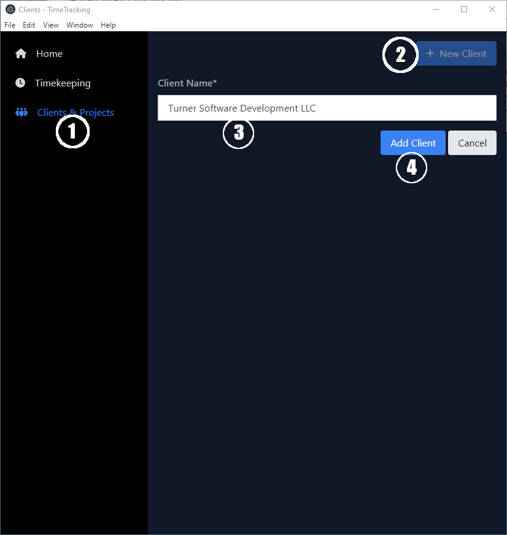

# TimeTracking

TimeTracking is a cross-platform _**desktop**_ application for tracking the time
that you work for clients. I created it specifically for my own use in
freelance software development to replace the spreadsheets I was using,
but it should be usable for other professions.

<div style="padding:10px;border-radius:0.5rem;background-color:#53c5eb">
   <p style="color:white;font-weight:bold;font-size:large">IMPORTANT</p>
   <p style="color:white"> TimeTracking is not yet ready for public use. I started developing it
      in earnest in September 2022, and expect to have a usable version by
      the end of 2022.</p>
</div>

* Cross-platform: runs on Windows, macOS, and Linux
* Data is stored locally, never in the cloud
* Works offline (i.e. without an Internet connection)
* Export time records to a spreadsheet (e.g. for creating invoices, reporting, etc)
* Create backups of the TimeTracking database, and restore from them
* [Pomodoro timers](https://en.wikipedia.org/wiki/Pomodoro_Technique) help you focus on your work :tomato:
* Free and Open Source under the [Mozilla Public License](https://en.wikipedia.org/wiki/Mozilla_Public_License)

## Installation

TimeTracking executables for various platforms are not currently available.
Links to these will be added here once I start building them. Until then,
clone the Github repo, and run:

```shell
npm install
npm run build
```

The application will be built in the `dist` directory.

### Windows

Run the `TimeTracking-[version].exe` file to install the application. A shortcut
will be added to your Desktop that you can use to run it.

### Linux

Copy the `TimeTracking-[version].AppImage` to your `~/bin` directory, and ensure
that you have execute permissions by running `chmod u+x ~/bin/TimeTracking-[version].AppImage`.
The `~/bin` directory should already be in your `$PATH`, so you should be able to run TimeTracking
anywhere from the command line.

### macOS

TODO

## Usage

### Add a client

1. Select `Clients & Projects` from the sidebar
2. Press the `New Client` button
3. Enter the name of the client
4. Press the `Add Client` button



### Edit a client

### Delete a client

<div style="padding:10px;border-radius:0.5rem;background-color:#f8383f">
   <p style="color:white;font-weight:bold;font-size:large">WARNING</p>
   <p style="color:white">Deleting a client will delete all projects and time records associated
with the client.</p>
</div>

### Add a project

### Edit a project

### Delete a project

<div style="padding:10px;border-radius:0.5rem;background-color:#53c5eb">
   <p style="color:white;font-weight:bold;font-size:large">IMPORTANT</p>
   <p style="color:white"> Any time records associated with the project will not have the deleted
project  associated with them anymore.</p>
</div>

### Record time

### Edit a time record

### Delete a time record

## Contributing

There are several ways you can contribute to TimeTracking development:

* Use it, and let us know if you like it, problems you run into, and changes you would like us to make
* Create issues in Github for bugs and feature requests
* Work on Gitlab issues. Fork the Github repository, make changes, and submit pull requests to have your changes added to TimeTracking
